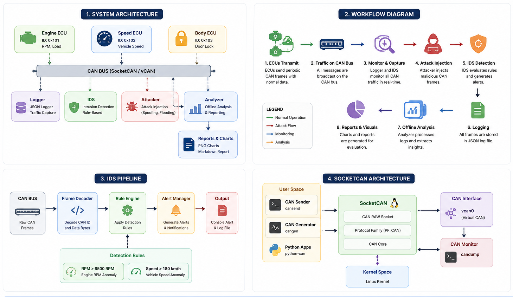

# System Architecture

This project models a simplified in-vehicle network to demonstrate CAN Bus communication, attack simulation, and intrusion detection in a controlled laboratory environment.

---

# High-Level Architecture

> *(Insert `assets/diagrams/system_architecture.png` here.)*



The laboratory is composed of five major components:

1. ECU Simulation
2. CAN Communication Layer
3. Attack Module
4. Intrusion Detection System
5. Logging and Analysis

---

# System Workflow

```text
               +----------------+
               |  Engine ECU    |
               +----------------+
                       │
               +----------------+
               |  Speed ECU     |
               +----------------+
                       │
               +----------------+
               |  Body ECU      |
               +----------------+
                       │
                       ▼
             =====================
                CAN BUS (vCAN)
             =====================
                       │
      ┌────────────────┼─────────────────┐
      ▼                ▼                 ▼

+------------+   +------------+   +--------------+
|  Logger    |   |    IDS     |   |  Attacker    |
+------------+   +------------+   +--------------+
      │                │
      ▼                ▼
 JSON Log File     Security Alerts
      │
      ▼
 Offline Analyzer
      │
      ▼
 Charts & Reports
```

---

# ECU Simulation

The simulator models three Electronic Control Units (ECUs):

| ECU | CAN ID | Purpose |
|------|-------:|---------|
| Engine ECU | 0x101 | Engine RPM and load |
| Speed ECU | 0x102 | Vehicle speed |
| Body ECU | 0x103 | Door lock status |

Each ECU periodically transmits CAN frames that represent normal vehicle behaviour.

---

# CAN Communication

The laboratory supports two communication backends:

## Python CAN Simulator

A custom in-memory CAN bus implementation used to demonstrate CAN concepts without requiring Linux CAN support.

## Linux SocketCAN

A realistic CAN networking environment built using:

- Virtual CAN (`vcan`)
- SocketCAN
- CAN-utils
- `python-can`

This enables interaction with standard Linux CAN tooling.

---

# Attack Module

The attack module injects malicious CAN frames onto the network to simulate common automotive attack scenarios.

Current demonstrations include:

- Engine RPM spoofing
- Vehicle speed spoofing
- CAN message injection
- Bus flooding

Future work:

- Replay attacks
- ECU impersonation
- Fuzz testing

---

# Intrusion Detection System

The IDS continuously monitors CAN traffic for anomalous behaviour.

Current detection rules include:

| Rule | Threshold |
|--------|-----------|
| RPM | > 6500 RPM |
| Speed | > 180 km/h |

When a threshold is exceeded, the IDS immediately generates an alert.

---

# Logging Pipeline

Every CAN frame can be recorded for offline analysis.

Captured traffic is stored as structured JSON, enabling automated analysis and report generation.

The analyzer produces:

- RPM trend
- Vehicle speed trend
- ECU traffic distribution
- Intrusion summary
- Markdown analysis report

---

# Design Goals

The laboratory was designed with the following objectives:

- Demonstrate CAN Bus fundamentals
- Explore automotive attack scenarios
- Build a simple IDS
- Analyze captured CAN traffic
- Provide a reproducible SocketCAN laboratory
- Serve as a portfolio project demonstrating practical automotive cybersecurity skills
---

## Security Monitoring Design

The IDS operates passively and does not interfere with normal CAN communications. It observes network traffic and raises alerts when messages violate predefined safety thresholds.

This approach mimics the behavior of monitoring systems commonly deployed in automotive cybersecurity environments.

---

## Design Decisions

### Why Python?

Python enables rapid prototyping and experimentation.

### Why a Simulated CAN Bus?

The simulation allows automotive security concepts to be explored without requiring specialized hardware.

### Why Threshold-Based Detection?

Threshold-based detection is easy to implement, validate, and explain while demonstrating fundamental IDS concepts.

---

## Future Improvements

* SocketCAN integration
* Physical CAN hardware support
* Replay attack detection
* CAN bus flooding detection
* Machine-learning anomaly detection
* Gateway ECU simulation
* Real-time dashboard visualization
