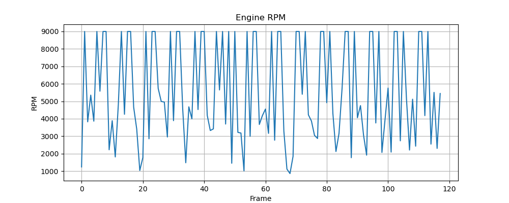
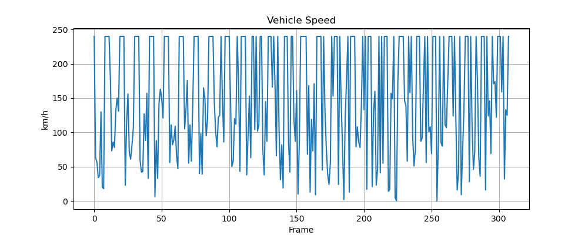
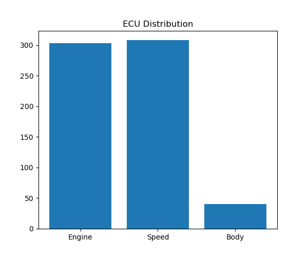
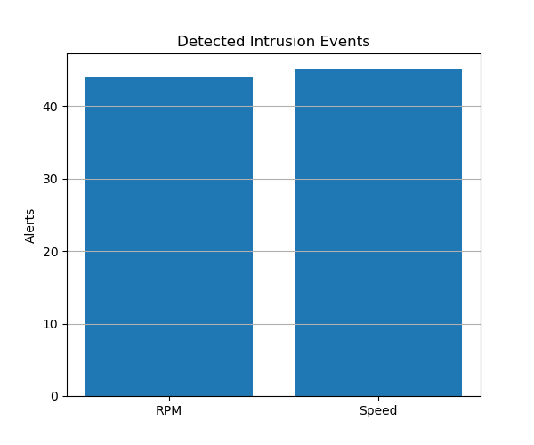

# Analysis Results

This page presents the results obtained from running the Automotive Cybersecurity Laboratory. The analysis is based on CAN traffic captured during both normal vehicle operation and simulated attack scenarios.

---

# Experimental Setup

The laboratory was configured using the following components:

| Component | Description |
|-----------|-------------|
| CAN Backend | Python Simulator / Linux SocketCAN |
| Network | Virtual CAN (`vcan0`) |
| Logger | JSON Traffic Logger |
| IDS | Rule-Based Detection |
| Analyzer | Python Log Analyzer |

---

# Normal Operation

During normal operation, three Electronic Control Units periodically transmit CAN frames:

- Engine ECU
- Speed ECU
- Body ECU

The IDS continuously monitors network traffic while the logger records every frame for offline analysis.

---

# Attack Scenarios

The following attacks were performed during testing.

| Attack | Description | Expected Detection |
|---------|-------------|--------------------|
| RPM Spoofing | Inject unrealistic engine RPM | RPM Alert |
| Speed Spoofing | Inject excessive vehicle speed | Speed Alert |
| Bus Flooding | High-rate CAN frame generation | Increased traffic volume |

---

# RPM Analysis

The RPM chart illustrates engine activity throughout the capture period. Values exceeding the configured threshold trigger IDS alerts.

---

# Vehicle Speed Analysis

The speed chart visualizes simulated vehicle speed. Malicious speed injections appear as abnormal spikes above the configured detection threshold.

---

# ECU Traffic Distribution

The distribution chart shows the proportion of CAN traffic generated by each simulated ECU during the experiment.

---

# Intrusion Detection Summary

The IDS successfully identified injected malicious CAN frames using rule-based anomaly detection.

Current detection rules include:

| Detection Rule | Threshold |
|----------------|-----------|
| Engine RPM | > 6500 RPM |
| Vehicle Speed | > 180 km/h |

---

# Generated Report

The analyzer automatically produces a Markdown report containing:

- Total captured CAN frames
- ECU traffic statistics
- IDS detections
- Generated charts
- Experiment summary

---

# Conclusions

The laboratory demonstrates the complete workflow of an automotive cybersecurity experiment:

1. Generate CAN traffic.
2. Inject malicious CAN frames.
3. Detect anomalies using a rule-based IDS.
4. Capture all CAN traffic.
5. Perform offline forensic analysis.
6. Generate reports and visualizations.

This workflow mirrors the stages of CAN traffic analysis commonly used during automotive cybersecurity research and testing.
