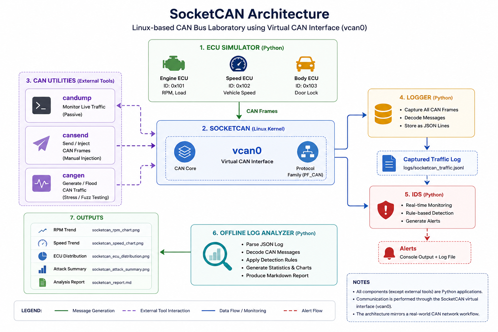

# Linux SocketCAN Laboratory

The SocketCAN Laboratory extends the Python-based CAN simulator by integrating the Linux SocketCAN framework. Instead of relying solely on an in-memory CAN bus, the laboratory communicates over a virtual CAN interface (`vcan0`) and uses the same tooling commonly employed during automotive software development and security research.

This environment demonstrates how CAN traffic can be generated, monitored, logged, analyzed, and attacked using standard Linux CAN utilities.

---

# Objectives

The SocketCAN laboratory was designed to demonstrate:

- Virtual CAN network configuration
- CAN traffic generation
- CAN traffic monitoring
- CAN frame logging
- CAN message injection
- Intrusion detection
- Offline traffic analysis

---

# Laboratory Architecture



The laboratory consists of:

- ECU Simulator
- Virtual CAN Interface (`vcan0`)
- SocketCAN
- CAN-utils
- Logger
- Intrusion Detection System (IDS)
- Offline Log Analyzer

---

# Technology Stack

| Component | Technology |
|-----------|------------|
| Operating System | Linux |
| CAN Framework | SocketCAN |
| Virtual Interface | vcan |
| Traffic Generator | python-can |
| CAN Utilities | cansend, candump, cangen |
| Logger | Python |
| IDS | Rule-Based Python IDS |
| Visualization | Matplotlib |

---

# Laboratory Workflow

The complete workflow is shown below.

```text
Create vcan0
        │
        ▼
Start Logger
        │
        ▼
Start IDS
        │
        ▼
Launch ECU Simulator
        │
        ▼
Generate CAN Traffic
        │
        ▼
Inject Attacks
        │
        ▼
Capture Traffic
        │
        ▼
Generate Analysis Report
```

---

# Creating the Virtual CAN Interface

The laboratory automatically creates a virtual CAN interface.

Equivalent commands:

```bash
sudo modprobe vcan

sudo ip link add dev vcan0 type vcan

sudo ip link set up vcan0
```

Verify the interface:

```bash
ip link show vcan0
```

Expected output:

```text
vcan0: <NOARP,UP,LOWER_UP> mtu 16 ...
```

---

# Generating CAN Traffic

The ECU simulator periodically transmits CAN frames onto `vcan0`.

Example CAN IDs:

| ECU | CAN ID |
|------|--------|
| Engine ECU | 0x101 |
| Speed ECU | 0x102 |
| Body ECU | 0x103 |

Typical traffic includes:

- Engine RPM
- Engine Load
- Vehicle Speed
- Door Lock Status

---

# Monitoring CAN Traffic

Traffic can be observed in real time using `candump`.

```bash
candump vcan0
```

Example output:

```text
vcan0  101   [2]  12 34
vcan0  102   [2]  00 78
vcan0  103   [1]  01
```

---

# CAN Traffic Generation with cangen

The project also supports traffic generation using `cangen`.

Example:

```bash
cangen vcan0
```

Useful options include:

```bash
cangen vcan0 -g 10
```

Generate a frame every 10 ms.

```bash
cangen vcan0 -I 101 -L 8
```

Generate traffic using a specific CAN ID.

---

# Injecting CAN Frames

Individual CAN frames can be transmitted using `cansend`.

Example:

```bash
cansend vcan0 101#1122334455667788
```

This is useful for testing:

- ECU spoofing
- IDS detection
- Decoder validation

---

# Logging CAN Traffic

Every received CAN frame is recorded as structured JSON.

Example:

```json
{
    "timestamp": 1781276080.2128973,
    "can_id": "0x101",
    "data": {
        "rpm": 5179,
        "load": 73
    }
}
```

The resulting log serves as the input to the offline analyzer.

---

# Intrusion Detection

The IDS continuously monitors CAN traffic.

Current detection rules include:

| Detection | Threshold |
|------------|-----------|
| RPM | > 6500 RPM |
| Vehicle Speed | > 180 km/h |

Detected anomalies generate alerts and are recorded for later analysis.

---

# Offline Analysis

The analyzer processes captured traffic and automatically generates:

- RPM trend
- Vehicle speed trend
- ECU distribution
- IDS summary
- Markdown analysis report

Example output:

```text
analysis/

socketcan_rpm_chart.png

socketcan_speed_chart.png

socketcan_ecu_distribution.png

socketcan_attack_summary.png

socketcan_report.md
```

---

# Running the Laboratory

From the project root:

```bash
./start_lab.sh
```

This script automatically:

- Creates `vcan0`
- Starts the logger
- Starts the IDS
- Launches the ECU simulator

To inject attacks:

```bash
./socketcan/attacks/run_attacks.sh
```

To analyze captured traffic:

```bash
python3 tools/socketcan_log_analyzer.py
```

To stop the laboratory:

```bash
./stop_lab.sh
```

---

# Skills Demonstrated

This laboratory demonstrates practical experience with:

- Linux networking
- SocketCAN
- CAN-utils
- python-can
- CAN Bus analysis
- Automotive cybersecurity
- Intrusion detection
- Log analysis
- Technical documentation

---

# Future Enhancements

Planned improvements include:

- Replay attack simulation
- CAN FD support
- DBC decoding
- ISO-TP communication
- UDS diagnostics
- Message authentication
- Statistical anomaly detection
- Real CAN hardware integration
